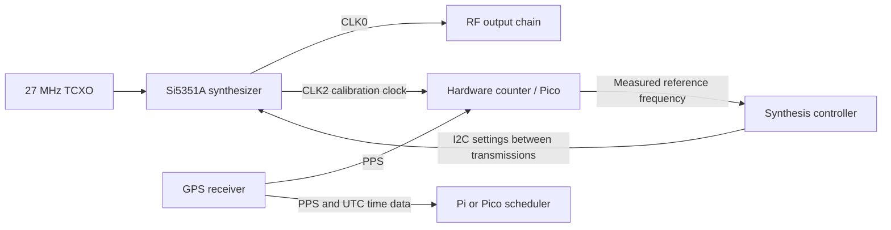

# Optional GPS frequency calibration for Pi and Pico

Status: proposed design consideration, recorded 2026-09-12. This proposal has
not been implemented in the schematic, PCB, or transmitter firmware and has no
physical or RF qualification evidence.

The authoritative design target is the Si5351A in the three-output MSOP-10
package. Use the Skyworks Si5351 documentation for electrical limits, reference
inputs, clock routing, and register behavior throughout this proposal. The
existing board's clone assignment is baseline history, not the specification
for the proposed circuit. Si5351C is discussed only as an optional alternative
for a dedicated external-reference input.

## Purpose and benefits

Retain the board's 27 MHz temperature-compensated crystal oscillator (TCXO) as
the local frequency reference and use a spare synthesizer output to measure its
error against an optional GPS receiver's pulse-per-second (PPS) signal. Apply
the measured reference frequency to subsequent RF synthesis calculations.

This arrangement provides a common RF circuit for Raspberry Pi and Pico hosts,
automatic frequency calibration when GPS PPS is available, and continued
operation from the TCXO when GPS is absent. It requires an ordinary GPS receiver
with a suitable PPS output, not a separate GPS-disciplined oscillator (GPSDO).
The intended benefits are reduced manual calibration and compensation for slow
reference-frequency changes caused by temperature and aging.

The TCXO supplies short-term stability. GPS supplies the independent long-term
measurement reference. Software compensates the RF output; it does not physically
tune the existing TCXO. Frequency calibration does not by itself improve phase
noise, eliminate synthesizer spurs, or establish a fixed RF phase relative to UTC.

## Existing circuit

The baseline is Synth Universal v1.0.0 at repository commit `cf6e53a`. The
[schematic](Wsprry-Pi-Synth-Univ.kicad_sch) and
[PCB](Wsprry-Pi-Synth-Univ.kicad_pcb) specify:

| Component or connection | Existing design |
| --- | --- |
| Y31 | MS5351M in MSOP-10, represented by an Si5351A symbol |
| Y21 | ATX-11-F-27.000MHZ-F05-T, 27 MHz TCXO |
| Reference input | Y21 output through C24 and R21 to Y31 XA, pin 2; XB, pin 3, unconnected |
| CLK0 | Pin 10, connected to the RF output chain |
| CLK1 | Pin 9, marked unconnected |
| CLK2 | Pin 6, marked unconnected |

The design presently has no CLK1/CLK2 calibration route. The table records the
existing source assets; the proposed circuit uses Si5351A as specified above.

## Proposed circuit

Bring CLK2 to a calibration connection through a provision for a source series
resistor. Route the signal with a nearby ground return and away from sensitive
reference and RF circuitry. Select resistance, drive strength, and any buffer
from the actual load, edge quality, and RF measurements. CLK1 remains available
for another use; either spare output could perform calibration if allocation
changes.

Provide a GPS PPS input to a hardware counter or capture circuit. The counter
also receives CLK2 and measures its cycles over intervals bounded by valid PPS
edges. Provide ground and appropriate input conditioning for the selected GPS
receiver and controller voltage levels. Distribute PPS to host scheduling as
needed; GPS time messages supply the corresponding UTC second and receiver
validity information.

Use a known, fixed ratio between CLK2 and the TCXO during each measurement.
A reference-derived output or a separately allocated PLL is a candidate, subject
to verification of the Si5351A configuration. RF tone changes, PLL resets, output
disables, and calibration updates must not silently change the measurement
ratio. Discard any interval affected by such an event. The synthesizer controller
must own both RF and calibration configuration so that independent writers do
not overwrite PLL or output-enable settings.

For a fixed ratio `k = f_CLK2 / f_reference`, counting `N` cycles over `T` GPS
seconds gives `f_reference = N / (T * k)`. Use the actual programmed ratio, not
merely the requested nominal output frequency. Accumulate and filter measurements
over a suitable interval before accepting a new reference estimate. Counter
quantization, PPS jitter, capture uncertainty, and TCXO drift during the interval
determine useful accuracy and averaging time.

QRP Labs provides a precedent: its Si5351A VFO uses CLK2 at one-quarter of the
27 MHz reference, measures it with a microcontroller timer against GPS PPS, and
uses the measured reference in frequency calculations. That is an architectural
example, not validation of the proposed board or its Si5351A configuration.

## Pi and Pico integration

| Host | Proposed implementation |
| --- | --- |
| Pico | Use hardware counting/capture or PIO to measure CLK2 between GPS PPS boundaries. Reserve the necessary pins and peripheral resources alongside transmission functions. |
| Pi | Use a small MCU counter, potentially the same Pico implementation, and read completed measurements over a digital interface. Linux scheduling latency must not define the precision measurement interval. |

The RF/reference portion can remain common across both hosts. A Pi installation
needs the counter hardware; a Pico installation can potentially perform that
function on its existing controller. Exact pin assignments, interface, resource
allocation, and simultaneous RF/counter operation remain implementation work.

The RP2040's ordinary frequency-counter API uses its local reference clock to
define the interval. Calling that API alone does not provide GPS calibration.
The proposed measurement must explicitly reference PPS boundaries. PPS can also
support Pico scheduling calibration without using CLK1/CLK2 as its system clock.

On a Pi, GPS PPS and time data can discipline the operating-system clock through
chrony. That is separate from correcting the synthesizer's RF frequency. Feeding
CLK2 back without an independent reference only compares two local oscillators;
it cannot establish which oscillator has the correct absolute frequency.

## Operation with and without GPS

| Reference state | Proposed behavior |
| --- | --- |
| Valid GPS PPS, no GPSDO | Measure TCXO error through CLK2 and update the RF reference estimate. |
| No GPS and no saved calibration | Operate from the TCXO using its nominal reference frequency; absolute accuracy is uncalibrated. |
| No GPS, valid saved calibration | Apply the previous estimate. New temperature changes and aging are not automatically corrected. |
| GPS lost after calibration | Retain the last accepted estimate as holdover and report its age and loss of GPS validity. |
| GPS restored | Validate and filter new measurements before accepting a correction. |

PPS presence alone is insufficient proof of a valid GPS reference: some receivers
continue pulses without satellite lock. Use receiver-specific timing validity
and reject missing, malformed, or invalid measurement intervals.

Apply accepted corrections between transmissions and hold the correction fixed
throughout each WSPR frame or other defined transmission unit. Persist calibration
with oscillator/board identity and age metadata, and avoid applying it to a
different reference source. Frequency holdover does not imply valid UTC slot
timing; the host's time-validity and transmission policy remain separate.

Standalone stability remains that of the assembled TCXO circuit. This proposal
does not specify a guaranteed frequency error, acquisition time, or holdover
duration; those require measurements.

## Optional direct GPSDO reference

A clean external GPSDO reference is a possible later alternative to the local
TCXO. For the Si5351A, the manufacturer documents a 25/27 MHz reference
through an AC-coupled XA input with XB floating. A future external-reference
option would need source isolation or selection, correct amplitude and coupling,
and configuration matched to the selected reference. Do not connect an external
source in parallel with an active TCXO output.

Si5351A XA is not a general-purpose 3.3 V logic input. GPS 1 PPS cannot directly
replace the MHz reference. A standard 10 MHz GPSDO has a documented input route through
Si5351C CLKIN, requiring a different device/package and circuit design rather
than a direct substitution on the existing board.

A GPS receiver's programmable MHz pulse output is not automatically equivalent
to a clean GPSDO. Receiver-dependent quantization and jitter can require clock
cleanup. Direct reference replacement is therefore an optional upgrade after
frequency-stability and spectral measurements establish a need.

## Implementation and validation gates

Before adopting this proposal, finalize the Si5351A ordering code and verify the
circuit against its reference-input limits, calibration-output routing, PLL
allocation, and register behavior. Update the schematic and BOM to specify the
Si5351A as part of implementation. Complete counter sizing, PPS capture design,
electrical interface checks, and firmware ownership of shared resources.

For the eventual circuit change, run ERC/DRC and inspect the schematic and PCB.
Then measure calibration convergence, behavior during RF tone changes, GPS loss
and recovery, temperature drift, holdover, and RF spectrum with calibration
enabled and disabled. Tie results to the exact board revision, assembly,
firmware, configuration, and conducted measurement setup. Use an independent
measurement reference to check the resulting RF accuracy.

The baseline connectivity review used KiCad 10.0.1 netlist export without saving
or migrating the KiCad source files. That export is connectivity evidence only;
it is not ERC/DRC or physical qualification. Existing missing-library and model
limitations remain documented in the [repository README](../README.md).

## References

- [QRP Labs VFO operating manual, page 9](https://www.qrp-labs.com/images/vfo/vs_op_1.04_A4.pdf): CLK2 measurement against GPS PPS and software reference correction.
- [Skyworks Si5351A/B/C datasheet, sections 4.1 and 6.6](https://www.skyworksinc.com/-/media/Skyworks/SL/documents/public/data-sheets/Si5351-B.pdf): reference inputs, device variants, and external XA drive.
- [Raspberry Pi RP2040 datasheet](https://datasheets.raspberrypi.com/rp2040/rp2040-datasheet.pdf): PIO and frequency-counter reference-clock behavior.
- [Chrony reference-clock documentation](https://chrony-project.org/doc/4.7/chrony.conf.html#refclock): PPS and system-time synchronization.
- [u-blox GPS timing application note](https://content.u-blox.com/sites/default/files/products/documents/Timing_AppNote_%28GPS.G6-X-11007%29.pdf): time-pulse quantization and external clock cleanup.
