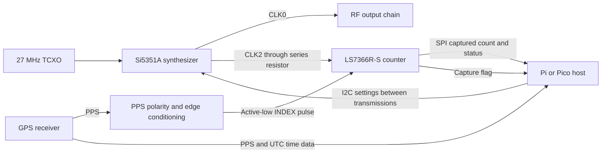

# Optional GPS frequency calibration for Pi and Pico

Status: selected architecture, updated 2026-09-12. The LS7366R is the selected
feedback counter for both Pi and Pico implementations. The circuit below remains
a proposal: it has not been implemented in the schematic, PCB, or transmitter
firmware and has no physical or RF qualification evidence.

The authoritative design target is the Si5351A in the three-output MSOP-10
package. Use the Skyworks Si5351 documentation for electrical limits, reference
inputs, clock routing, and register behavior throughout this proposal. The
existing board's clone assignment is baseline history, not the specification
for the proposed circuit. Si5351C is discussed only as an optional alternative
for a dedicated external-reference input.

## Purpose and benefits

Retain the board's 27 MHz temperature-compensated crystal oscillator (TCXO) as
the local frequency reference and use a spare synthesizer output to measure its
error against an optional GPS receiver's pulse-per-second (PPS) signal. Apply
the measured reference frequency to subsequent RF synthesis calculations.

This arrangement provides a common RF circuit for Raspberry Pi and Pico hosts,
automatic frequency calibration when GPS PPS is available, and continued
operation from the TCXO when GPS is absent. It requires an ordinary GPS receiver
with a suitable PPS output, not a separate GPS-disciplined oscillator (GPSDO).
The intended benefits are reduced manual calibration and compensation for slow
reference-frequency changes caused by temperature and aging. An LS7366R captures
the count in hardware and exposes it over SPI, giving both hosts the same
measurement circuit and data-processing model. No additional calibration MCU,
counter firmware image, or local precision oscillator is required. The Pico does
not need to dedicate PIO or DMA resources to continuous CLK2 counting, and Linux
scheduling latency does not define the measurement interval.

The TCXO supplies short-term stability. GPS supplies the independent long-term
measurement reference. Software compensates the RF output; it does not physically
tune the existing TCXO. Frequency calibration does not by itself improve phase
noise, eliminate synthesizer spurs, or establish a fixed RF phase relative to UTC.

## Existing circuit

The baseline is Synth Universal v1.0.0 at repository commit `cf6e53a`. The
[schematic](Wsprry-Pi-Synth-Univ.kicad_sch) and
[PCB](Wsprry-Pi-Synth-Univ.kicad_pcb) specify:

| Component or connection | Existing design |
| --- | --- |
| Y31 | MS5351M in MSOP-10, represented by an Si5351A symbol |
| Y21 | ATX-11-F-27.000MHZ-F05-T, 27 MHz TCXO |
| Reference input | Y21 output through C24 and R21 to Y31 XA, pin 2; XB, pin 3, unconnected |
| CLK0 | Pin 10, connected to the RF output chain |
| CLK1 | Pin 9, marked unconnected |
| CLK2 | Pin 6, marked unconnected |

The design presently has no CLK1/CLK2 calibration route. The table records the
existing source assets; the proposed circuit uses Si5351A as specified above.

## Proposed circuit

Use the LS7366R-S in SOIC-14, powered from the common 3.3 V logic rail. This
package is the selected baseline for assembly and probing. CLK0 remains the RF
output, CLK2 supplies the calibration clock, and CLK1 remains available.

### Counter connections

| LS7366R pin | Proposed connection |
| --- | --- |
| 14, VDD | 3.3 V |
| 3, VSS | Ground |
| 12, A | Si5351A CLK2 through source series resistor |
| 11, B | 3.3 V, selecting upward counting |
| 13, CNT_EN | 3.3 V, keeping hardware counting enabled |
| 10, INDEX/ | Conditioned active-low PPS |
| 4, SS/ | Host chip select with 10 kΩ pull-up |
| 5, SCK | Host SPI clock |
| 7, MOSI | Host SPI controller output |
| 6, MISO | Host SPI controller input |
| 8, LFLAG/ | Host capture notification, 10 kΩ pull-up to 3.3 V |
| 9, DFLAG/ | Unconnected |
| 2, fCKi | Ground; unused in non-quadrature mode |
| 1, fCKO | Unconnected |

The LS7366R supports non-quadrature counting, hardware loading of its output
register from INDEX, and 20 MHz counting at 3.3 V. These are the features used
here; its quadrature decoder and filter oscillator are unused. See the
[manufacturer datasheet](https://lsicsi.com/wp-content/uploads/2021/06/LS7366R.pdf).

Place a proposed 100 nF bypass capacitor directly between the counter's supply
and ground, with 1 µF nearby. Start CLK2 routing with a 33 Ω series-resistor
footprint at the Si5351A output. These passive values are design starting points,
subject to signal-integrity and supply measurements. Keep the MHz trace short,
with a continuous ground return, and separate it from the TCXO input and RF
output circuitry. Keep CLK2 and the counter at compatible 3.3 V logic levels.

### PPS input

Define the shared board interface for an active-high, 3.3 V PPS signal whose
rising edge identifies the GPS second. Use a 3.3 V SN74LVC1G14 Schmitt-trigger
inverter as the initial conditioning stage so that this edge produces an
active-low INDEX transition. Provide 100 nF local bypassing and a proposed
100 kΩ input pull-down so an absent receiver leaves INDEX inactive. The
[TI device documentation](https://www.ti.com/product/SN74LVC1G14) describes its
Schmitt input and supported supply range. This inverter conditions polarity and
edges; it does not validate GPS timing or provide galvanic isolation.

PPS pulse width and the LS7366R's asynchronous INDEX capture behavior must be
verified together. Acceptance requires a reproducible capture boundary tied to
the intended PPS edge, including when that edge approaches a CLK2 transition.
Confirm whether additional pulse shaping is needed before finalizing this input
stage; do not assume that an arbitrarily long active-low pulse produces the
required edge capture. Measure propagation delay and its variation as part of
the timing budget.

Distribute the original active-high PPS to the host as well. GPS UTC messages
and receiver validity reach the host through its GPS interface. A different PPS
voltage, polarity, or open-drain receiver output requires an explicit input-stage
adaptation. Check power sequencing so a separately powered receiver or host
cannot back-power an unpowered board.

### Calibration clock

Use a nominal 6.75 MHz calibration output as the initial frequency plan, targeting
one-quarter of the 27 MHz reference. This leaves margin below the counter's
3.3 V input-frequency limit. Verify the complete Si5351A routing and divider
configuration before implementation; the nominal frequency alone does not
establish the measurement ratio.

Use a known, fixed ratio between CLK2 and the TCXO during each measurement.
A reference-derived output or a separately allocated PLL is a candidate, subject
to verification of the Si5351A configuration. RF tone changes, PLL resets, output
disables, and calibration updates must not silently change the measurement
ratio. Discard any interval affected by such an event. The synthesizer controller
must own both RF and calibration configuration so that independent writers do
not overwrite PLL or output-enable settings.

For a fixed ratio `k = f_CLK2 / f_reference`, counting `N` cycles over `T` GPS
seconds gives `f_reference = N / (T * k)`. Use the actual programmed ratio, not
merely the requested nominal output frequency. Accumulate and filter measurements
over a suitable interval before accepting a new reference estimate. Counter
quantization, PPS jitter, capture uncertainty, and TCXO drift during the interval
determine useful accuracy and averaging time.

QRP Labs provides a precedent: its Si5351A VFO uses CLK2 at one-quarter of the
27 MHz reference, measures it with a microcontroller timer against GPS PPS, and
uses the measured reference in frequency calculations. That is an architectural
precedent for the calibration method; this proposal selects LS7366R hardware
capture instead of its MCU timer implementation.

### Capture and readout

Configure the counter for 32-bit, free-running, non-quadrature operation and
INDEX-driven transfer of CNTR into OTR. Enable the index flag for notification.
Read OTR directly: reading CNTR also refreshes OTR and would replace the PPS
capture. OTR holds one capture, not a FIFO. These register behaviors are specified
in the [LS7366R datasheet](https://lsicsi.com/wp-content/uploads/2021/06/LS7366R.pdf).

The host configures the device at startup and reads the mode registers back.
Invalidate prior measurements after a host restart, counter reset, power loss,
or any clock configuration change. Do not reset or stop the counter at each PPS;
use differences between captured cumulative counts.

Begin with SPI mode 0, MSB first, at a conservative 1 MHz. Keep chip select active
across each complete command and payload, and deassert it between commands.
Retrieve the capture and relevant status after the accepted PPS event and before
the following capture. Keep a guarded read window away from PPS transitions,
and reject a read that overlaps an update or cannot be associated with a known
PPS sequence. The notification flag is not an event counter; repeated events
cannot be reconstructed from a single asserted flag. Save status before clearing
the latched notification, and perform acknowledgement within the same guarded
window so it cannot erase an unprocessed new event.

Track the host's PPS sequence, GPS validity, counter state, and measurement
configuration with each sample. Detect missed reads and reject ambiguous
intervals. Counter arithmetic uses modulo 2^32 subtraction, with fewer than
2^32 input cycles between the compared captures. At 6.75 MHz the wrap period
is approximately 636 seconds; accumulate validated shorter intervals into a
wider software total for longer observation windows.

For a continuous observation, calculate frequency from the count difference
between its endpoints and the actual number of GPS seconds. The calculated
one-count resolution at nominal 6.75 MHz is:

| Interval | Fractional one-count resolution |
| --- | --- |
| 1 second | 0.148 ppm |
| 10 seconds | 0.0148 ppm |
| 60 seconds | 0.00247 ppm |

These values are `1 / (6,750,000 * interval)` expressed in ppm. They are not
accuracy guarantees or a complete uncertainty budget. Capture uncertainty, PPS
jitter, oscillator drift, missed events, and electrical noise require separate
assessment. The 6.75 MHz calibration signal remains RF energy that can couple
into the transmitter, even when CLK0 is disabled.

## Pi and Pico integration

| Host | Shared circuit integration |
| --- | --- |
| Pi | Read LS7366R captures through SPI and associate them with GPS PPS events. Use I2C to configure Si5351A. Linux does not gate or timestamp individual CLK2 cycles. |
| Pico | Read the same LS7366R captures through SPI and use the same measurement algorithm. Use I2C to configure Si5351A. Continuous counting needs no Pico PIO state machine or DMA channel. |

Keep the synthesizer, counter, PPS conditioner, and their local connections
identical in both variants. Adapt only the host connection and pin assignment.
Expose the following logical interface on the common circuit:

| Interface signal | Direction relative to host | Purpose |
| --- | --- | --- |
| 3V3 and GND | Supply and return | One defined power source for the shared circuit |
| SPI_SCK, SPI_MOSI, COUNTER_CS_N | Output | Counter configuration and read commands |
| SPI_MISO | Input | Captured count and status |
| COUNTER_IRQ_N | Input | Capture notification |
| GPS_PPS | Input | PPS association and scheduling |
| I2C_SCL, I2C_SDA | Bus | Si5351A configuration |

Only one host controls a board at a time. Route GPS data to the selected host's
GPS interface. Final Pi header and Pico GPIO mappings must be checked against
the affected board's existing assignments; this document does not reserve GPIOs
already used for RF, band selection, or other functions. Existing I2C pull-ups
must be included when calculating bus loading. Use a dedicated counter chip
select with an inactive default, and keep SPI traffic limited to configuration
and capture retrieval.

The host supplies software integration, filtering, and calibration persistence;
the LS7366R supplies hardware count capture. This replaces the earlier proposal
for an MCU counter on the Pi and PIO counting on the Pico. Host scheduling and
RF workloads still require validation, particularly the ability to retrieve
unambiguous captures within the one-second update interval.

On a Pi, GPS PPS and time data can discipline the operating-system clock through
chrony. That is separate from correcting the synthesizer's RF frequency. Feeding
CLK2 back without an independent reference only compares two local oscillators;
it cannot establish which oscillator has the correct absolute frequency.

## Operation with and without GPS

| Reference state | Proposed behavior |
| --- | --- |
| Valid GPS PPS, no GPSDO | Measure TCXO error through CLK2 and update the RF reference estimate. |
| No GPS and no saved calibration | Operate from the TCXO using its nominal reference frequency; absolute accuracy is uncalibrated. |
| No GPS, valid saved calibration | Apply the previous estimate. New temperature changes and aging are not automatically corrected. |
| GPS lost after calibration | Retain the last accepted estimate as holdover and report its age and loss of GPS validity. |
| GPS restored | Validate and filter new measurements before accepting a correction. |

PPS presence alone is insufficient proof of a valid GPS reference: some receivers
continue pulses without satellite lock. Use receiver-specific timing validity
and reject missing, malformed, or invalid measurement intervals.

Apply accepted corrections between transmissions and hold the correction fixed
throughout each WSPR frame or other defined transmission unit. Persist calibration
with oscillator/board identity and age metadata, and avoid applying it to a
different reference source. Frequency holdover does not imply valid UTC slot
timing; the host's time-validity and transmission policy remain separate.

Standalone stability remains that of the assembled TCXO circuit. This proposal
does not specify a guaranteed frequency error, acquisition time, or holdover
duration; those require measurements.

## Optional direct GPSDO reference

A clean external GPSDO reference is a possible later alternative to the local
TCXO. For the Si5351A, the manufacturer documents a 25/27 MHz reference
through an AC-coupled XA input with XB floating. A future external-reference
option would need source isolation or selection, correct amplitude and coupling,
and configuration matched to the selected reference. Do not connect an external
source in parallel with an active TCXO output.

Si5351A XA is not a general-purpose 3.3 V logic input. GPS 1 PPS cannot directly
replace the MHz reference. A standard 10 MHz GPSDO has a documented input route
through Si5351C CLKIN, requiring a different device/package and circuit design
rather than a direct substitution on the existing board.

A GPS receiver's programmable MHz pulse output is not automatically equivalent
to a clean GPSDO. Receiver-dependent quantization and jitter can require clock
cleanup. Direct reference replacement is therefore an optional upgrade after
frequency-stability and spectral measurements establish a need.

## Implementation and validation gates

Before adopting this proposal, finalize the Si5351A ordering code and verify the
circuit against its reference-input limits, calibration-output routing, PLL
allocation, and register behavior. Update the schematic and BOM to specify the
Si5351A and LS7366R-S as part of implementation. Finalize the PPS input stage,
host pin mappings, power sequencing, passive values, electrical interface checks,
and firmware ownership of shared resources. The LS7366R selection is decided;
these implementation details and acceptance results remain open.

For the eventual circuit change, run ERC/DRC and inspect the schematic and PCB.
Then measure calibration convergence, behavior during RF tone changes, GPS loss
and recovery, temperature drift, holdover, and RF spectrum with calibration
enabled and disabled. Exercise PPS capture across CLK2 phase, pulse-width, and
frequency variations, including counter carry transitions. Verify atomic OTR
readout, missed-PPS/read handling, rollover, reset recovery, and loaded-host
operation on both Pi and Pico. Tie results to the exact board revision, assembly,
firmware, configuration, and conducted measurement setup. Use an independent
measurement reference to check the resulting RF accuracy.

The baseline connectivity review used KiCad 10.0.1 netlist export without saving
or migrating the KiCad source files. That export is connectivity evidence only;
it is not ERC/DRC or physical qualification. Existing missing-library and model
limitations remain documented in the [repository README](../README.md).

## References

- [LSI/CSI LS7366R datasheet](https://lsicsi.com/wp-content/uploads/2021/06/LS7366R.pdf): pinout, counting modes, INDEX capture, OTR readout, SPI, and electrical timing.
- [LSI/CSI LS7366R product page](https://lsicsi.com/products/ls7366r-s-ls7366r-ts-ls7366r/): device family and package options.
- [TI SN74LVC1G14 documentation](https://www.ti.com/product/SN74LVC1G14): proposed PPS inversion and Schmitt-trigger conditioning.
- [QRP Labs VFO operating manual, page 9](https://www.qrp-labs.com/images/vfo/vs_op_1.04_A4.pdf): CLK2 measurement against GPS PPS and software reference correction.
- [Skyworks Si5351A/B/C datasheet, sections 4.1 and 6.6](https://www.skyworksinc.com/-/media/Skyworks/SL/documents/public/data-sheets/Si5351-B.pdf): reference inputs, device variants, and external XA drive.
- [Chrony reference-clock documentation](https://chrony-project.org/doc/4.7/chrony.conf.html#refclock): PPS and system-time synchronization.
- [u-blox GPS timing application note](https://content.u-blox.com/sites/default/files/products/documents/Timing_AppNote_%28GPS.G6-X-11007%29.pdf): time-pulse quantization and external clock cleanup.
