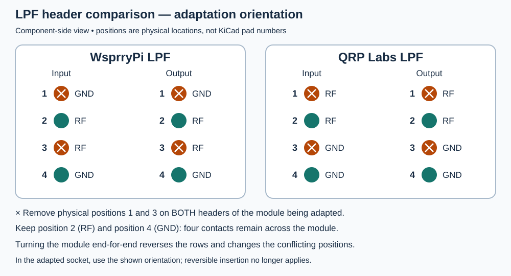

# WsprryPi LPF Board

A hand-assembled, seven-element low-pass filter (LPF) board with three series inductors and four shunt-capacitor positions. Each shunt position supports two parallel capacitors.

**Design status: in development; not yet qualified for production or RF use.** KiCad checks report zero DRC violations, zero unconnected items, and zero schematic-parity issues. Assembly fit and measured RF performance remain unverified.

## Project files

Open [WsprryPi LPF.kicad_pro](WsprryPi%20LPF.kicad_pro) in KiCad 10.0.1 or newer. The KiCad sources are authoritative; generate any required schematic export from the current source revision.

The [project libraries](libraries/README.md) contain every symbol and footprint used by the design, plus available 3D models. Keep the `libraries/` folder and library tables with the project; their `${KIPRJMOD}` paths resolve within this directory. Library documentation covers connector options, model limitations, sources, and licenses.

The [filter workbook](../LPF-Values.xlsx) lists standard E96/E24 values for a seven-element, 1 dB Chebyshev C-L-C ladder and its ideal, lossless 50-ohm response. Parallel E24 capacitor pairs are used where their sum better approaches the target value. The 3 dB cutoff and fundamental-loss columns are calculated from the listed installed values, not the unrounded prototype values. The board does not implement a DC-blocking capacitor.

The 2 m filter is fully specified as `47.5 pF – 60.4 nH – 68.1 pF – 63.4 nH – 68.1 pF – 60.4 nH – 47.5 pF`. Its modeled 3 dB cutoff is 148.279504 MHz and its modeled loss at the 144.4901 MHz upper WSPR edge is 0.376 dB. The row uses the 144.4899–144.4901 MHz transmit band in the [WSPR frequency list](https://www.wsprnet.org/drupal/sites/wsprnet.org/files/wspr-qrg.pdf). Only the 2 m QRSS frequency cell is blank; no 2 m QRSS operating frequency is asserted by this project.

## Assembly

The input and output connectors are hand-fitted male 1×4 headers with 2.54 mm pin pitch. The current schematic and PCB represent both headers as one component, **J1**, using the project-local paired-header footprint on the underside (B.Cu), with **33.02 mm centerline spacing**. No manufacturer or purchasing part number is specified. The connector and filter components are excluded from the BOM; a default BOM export is not a complete hand-assembly purchasing list.

### Connector pinouts and QRP Labs compatibility

J1 combines the input and output header rows:

| J1 header row | Ground pads | RF pads |
| --- | --- | --- |
| Input | 1 and 4 | 2 and 3, RF_IN |
| Output | 5 and 8 | 6 and 7, RF_OUT |

These are KiCad pad numbers, not the physical position numbers used for adaptation below. Looking down onto the component side of the saved board, the input row runs **4–3–2–1** and the output row runs **8–7–6–5** from the upper board edge to the lower edge because J1 is mounted underneath.

This design was inspired by the QRP Labs method of interchangeable plug-in LPFs, but it uses a **different pinout and is not directly compatible with QRP Labs LPFs**. The WsprryPi pinout groups the two RF contacts in the middle and brackets them with signal ground contacts. It was created to allow a denser signal path with nearby ground returns, with the intent of improving RF performance; that benefit has not yet been established by measurements on this board.

The diagram numbers **physical positions 1–4 from top to bottom**, independently of KiCad pad numbering. Both header rows have the illustrated pattern. QRP Labs uses RF–RF–GND–GND in the illustrated orientation, while WsprryPi uses GND–RF–RF–GND. See the [QRP Labs assembly drawing, page 3](https://qrp-labs.com/images/lpfkit/assembly_A4.pdf).

For the orientation shown, an operator may remove pins at **physical positions 1 and 3 from both headers of the module being adapted—four pins total**. The remaining positions **2 and 4 provide RF and ground**, respectively. This applies electrically to adapting a WsprryPi module to a QRP Labs socket or a QRP Labs module to a WsprryPi socket, provided the mechanical spacing and fit match. The WsprryPi paired header uses 33.02 mm spacing.

**Orientation matters:** turning the module end-for-end reverses both rows and changes which positions conflict. The WsprryPi GND–RF–RF–GND pinout and symmetric filter topology permit electrical connection in either direction in a matching WsprryPi socket. The cross-compatible two-contact arrangement is orientation-specific: after modification, use only the orientation shown for the adapted target socket. This is especially important because the unmodified outline alone does not establish a safe orientation.

A modified module has two empty positions in each header. It can still be electrically compatible with a socket using that module's native pinout. A WsprryPi socket has the symmetric GND–RF–RF–GND pattern, so a modified WsprryPi module can retain electrical compatibility in either native orientation. Removing pins reduces ground contacts and mechanical support. Confirm physical alignment and RF/ground contact mapping before applying RF. Adapter operation and the resulting RF response have not been physically verified.

### Toroid assembly

Core material, core size, and turn counts for L2, L4, and L6 remain unspecified in the KiCad design. Select and record them for the required inductance and intended operating band before winding.

Use **28 AWG enameled copper magnet wire (approximately 0.32 mm bare diameter)** as a provisional planning assumption, not an all-band or power-qualified requirement. The inductor footprint has **0.8 mm lead holes**. Strip the enamel from the lead portions, tin them, and mount the wound toroid upright as intended by the footprint.

Each winding has two ends: fit one end into **one pad numbered 1** and the other into **one pad numbered 2**. The footprint provides two alternative holes for each pad number; these are mounting choices, not four separate winding terminals. Do not put both winding ends into holes with the same pad number. Each pass through the core center counts as one turn.

Check the complete wound diameter, thickness, and height—including enamel, overlapping turns, lead bends, and any support or adhesive—against adjacent capacitors, inductors, board edges, and the mounting arrangement. LF windings may require multiple layers. The generic axial-inductor 3D model does not represent the finished toroid or prove clearance. Record the core, turns, wire size, measured inductance, and assembled dimensions for each filter.

### Capacitor population and lead spacing

Each of the four shunt-capacitor poles (`CA7/CB7`, `CA3/CB3`, `CA5/CB5`, and `CA1/CB1`) provides two electrically parallel footprints. Each individual footprint retains 2.50 mm lead spacing. A workbook entry written as `A + B` means that both listed capacitors are installed, one in each footprint; their order is electrically irrelevant.

For a single capacitor, there are two mounting options:

- **2.50 mm leads:** use pads 1 and 2 of either `CA` or `CB`, leaving the other footprint available for measured tuning.
- **5.00 mm leads:** span the pair, using ground pad 1 of `CA` and signal pad 2 of `CB`, or ground pad 1 of `CB` and signal pad 2 of `CA`. Both combinations provide 5.00 mm between hole centers at every pole. Do not use the two signal pads or the two ground pads together; those pairs connect to the same net.

The 5 mm option uses the existing holes and allows one wider-pitch capacitor to occupy the combined pair area. Treat both footprints as occupied by that capacitor unless a separate body-clearance check establishes room for an additional tuning part. Lead spacing alone does not establish body fit: check the selected capacitor's length, thickness, lead diameter, and clearance to the wound inductors and board edges. Record the installed capacitance, part numbers, and mounting option for each assembled filter.

### Space between filter elements

L4 and the inner capacitor pairs are centered, with space distributed between the four inductor/capacitor groups and clearance above and below L4. The following nominal gaps were measured between the existing footprint courtyards in the saved PCB on 2026-10-03:

| Adjacent elements | Courtyard gap |
| --- | ---: |
| End capacitor pair `CA1/CB1` to L2 | 0.81 mm |
| L2 to L4 | 0.66 mm |
| L4 to L6 | 0.69 mm |
| L6 to end capacitor pair `CA7/CB7` | 0.80 mm |
| Upper capacitor pair `CA3/CB3` to L4 | 0.87 mm |
| L4 to lower capacitor pair `CA5/CB5` | 0.91 mm |

These gaps distribute room for capacitor bodies and inductor windings while preserving the 5 mm capacitor mounting option. They are distances between footprint courtyards, not guaranteed clearances between assembled components. The capacitor footprints and generic inductor visualization do not describe every candidate body or wound toroid. Check the complete wound dimensions, including multilayer windings for LF filters, before selecting parts or producing manufacturing files. The paired header has 33.02 mm centerline spacing and 2.54 mm pin pitch.

The toroid model is a generic axial-inductor visualization. Check the wound component dimensions against the footprint before assembly.

## Validation

The saved design was checked on **2026-10-03 with KiCad 10.0.6**:

- **DRC:** zero violations and zero unconnected items, including a check with in-memory zone refill.
- **Schematic parity:** zero issues.
- **ERC:** no active violations; two explicitly excluded four-way-junction warnings remain visible. No ERC or DRC rule severity is set to `ignore`.
- **Libraries:** all placed symbols, footprints, and referenced STEP models resolve within the project-local library. All five symbols export successfully and all three footprints load successfully.
- **Vias:** 62 ground vias, each with a 0.6 mm pad and 0.3 mm drill; their centers lie within the saved ground fills on both copper layers.
- **Assembly documentation:** capacitor mounting options, courtyard gaps, and the paired-header geometry were checked against the saved sources and visual exports. The toroid's generic 3D model does not establish wound-component clearance.
- **BOM:** the connector and filter components are excluded from the BOM; a default export is not a complete hand-assembly purchasing list.

The title-block revision is `1.0.2`. The schematic identifies `RF_IN` as the electrical input; a `PWR_FLAG` documents externally supplied ground.

These checks do not establish assembly fit or electrical/RF performance. Treat the design as untested until revision-specific physical validation is documented. Re-run ERC and DRC with schematic parity after design changes and before producing manufacturing files. See the [repository conventions](../README.md) and [validation requirements](../CONTRIBUTING.md).
