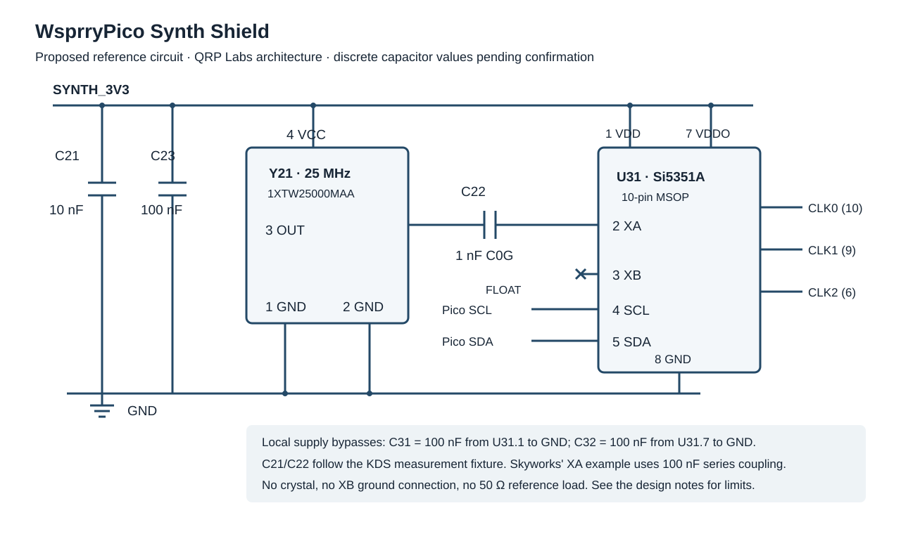

# TCXO and Si5351A reference circuit

Recorded 2026-10-06. Status: design intent and proposed circuit; 54 component symbols are placed in the KiCad schematic's eight decade-series boxes. Schematic wiring has progressed; PCB implementation remains pending.

[PARTS.md](PARTS.md) and [PARTS.csv](PARTS.csv) now specify the prototype values, dielectrics, ratings, ordering codes and local footprints for 53 inventory positions. J71 socket/header ordering codes and mating height remain open. L61 retains an unresolved FT37-43 sourcing conflict; neither a non-LCSC exception nor a substitute has been approved. These selections are assigned to the placed schematic instances; the PCB is unchanged. [SYMBOL-SOURCES.md](SYMBOL-SOURCES.md) records symbol provenance and placement. All headers, the SMA and hand-wound inductors are excluded from assembly BOM and position output, as required by the user.

Use Hans Summers' QRP Labs TCXO and synthesizer designs as the preferred circuit precedent. The selected reference is **KDS/Daishinku DSB321SDN, 1XTW25000MAA, 25 MHz, LCSC C253672**. Retain Si5351A as this design's synthesizer authority. Prefer documented QRP Labs circuitry over substitutions based only on frequency or ppm ratings.

The [reconciliation with the QRP electrical-model chat](RECONCILIATION.md) records the shared intent and remaining choices. The repository notes are authoritative; copies exported by earlier chats are snapshots. The photographed Rev6 synthesizer is modeled with MS5351M while this shield targets Si5351A.

**Target bands and 2 m WSPR locked 2026-10-06:** cover the amateur bands from **2200 m through 2 m**, including **WSPR on 2 m**, as explicitly confirmed by the user. Retain the selected **25 MHz** reference. The [newer U4B precedent and older U3S statement](#2-m-wspr-and-the-25-mhz-reference) are compared below; the older warning does not establish a universal reference-frequency prohibition. Implement and verify synthesis accuracy/spacing/transitions, reference continuity, amplifier output/thermal behavior and filtering across the target bands. No assembled shield has been qualified for this range.

**Reference assembly locked 2026-10-06:** fit the selected KDS oscillator directly on the shield, using its documented four-pad pin map. The user selected option 2, the discrete implementation. The shield's capacitor BOM and regulator support parts are specified in [PARTS.md](PARTS.md); placement and validation remain open.

**Component sourcing locked 2026-10-06:** use parts available from **LCSC stock**, as required by the user. Supplier selections must identify the exact manufacturer ordering code and LCSC C-number; recheck stock when completing the BOM and ordering. A catalog entry without inventory does not satisfy the requirement. The 27 MHz availability investigation has not changed the selected 25 MHz KDS reference or approved a substitute.

**I²C interface locked 2026-10-06:** connect Pico SDA/SCL directly to the Si5351A, with pull-ups to 3.3 V and no BSS123 level converters. The user selected option 1, direct 3.3 V I²C. Supply sequencing remains open.

**I²C GPIO pair locked 2026-10-06:** use **I²C0 on GP4/GP5**, as accepted by the user. Connect **GP4, Pico physical pin 6**, to **U31 SDA, pin 5**; connect **GP5, Pico physical pin 7**, to **U31 SCL, pin 4**. This is an approved pair in the [firmware pin-assignment contract](https://github.com/WsprryPi/WsprryPico/blob/devel/docs/pin-assignment-contract.md); reserve both pins atomically for the bus and allocate no direct Pico RF-output GPIO with the Si5351 engine. Bus speed and firmware adapters remain open; control GPIOs are locked below. The selected pair is design intent; the starter's wiring is unchanged.

**I²C pull-up supply locked 2026-10-06:** connect the upper ends of both SDA/SCL pull-up resistors to `SYNTH_3V3`, the selected clock regulator's output. The user accepted this rail assignment. Communicate on this interface only while the synth supply is available. The clock supply is always on with the selected input; define safe startup and actual supply-loss/removal behavior, leaving the Pico SDA/SCL pins undriven with their internal pull-ups disabled whenever the clock rail is unavailable. Validate powered/unpowered behavior and assess any additional devices or pull-ups before allowing a shared bus. This rail choice does not establish power-off tolerance for an unspecified device.

**I²C pull-up prototype values locked 2026-10-06:** fit **two 4.7 kΩ, ±1% resistors**, one from SDA to `SYNTH_3V3` and one from SCL to `SYNTH_3V3`, as accepted by the user. This is a shield adaptation of the QRP circuit. Reserve R31/R32, each 0603 UNI-ROYAL 0603WAF4701T5E / C23162, as specified in [PARTS.md](PARTS.md). Select bus speed and verify rise time with the actual bus capacitance before production acceptance. [Si5351 I²C pin guidance](https://www.skyworksinc.com/-/media/Skyworks/SL/documents/public/data-sheets/Si5351-B.pdf#page=33), [NXP I²C bus specification, pull-up sizing](https://www.nxp.com/docs/en/user-guide/UM10204.pdf)

**Power architecture locked 2026-10-06:** use a dedicated low-noise 3.3 V linear regulator supplied through the selected power-input selector. Its `SYNTH_3V3` output powers Y21 VCC, U31 VDD/VDDO and the selected I²C pull-up resistors. The user selected option 1, the dedicated regulator. Keep `SYNTH_3V3` separate from the Pico's 3V3 regulator output. Support-component specifications are recorded in [PARTS.md](PARTS.md); power sequencing remains open. Low noise is a design requirement; supply and RF measurements remain required.

**Power-input selector locked 2026-10-06:** use three pads labelled `VBUS / IN / VSYS`, with the center `IN` pad feeding the clock regulator and the amplifier's input boundary as selected below. Connect the VBUS outer pad to Pico pin 40 and the VSYS outer pad to pin 39. Fit a narrow, accessible copper link between VBUS and IN by default; leave the VSYS-to-IN solder gap open. Mark the cut point. The local PowerSelector_VBUS_IN_VSYS_Cuttable footprint implements this default copper state; JP41 is placed in the schematic's 40-series box; its connections and PCB implementation remain pending.

For a change to VSYS, power off, cut the VBUS-to-IN link, verify that it is open, then solder VSYS to IN. Only one selector connection may be closed. Closing both bypasses the Pico's VBUS-to-VSYS isolation diode and can feed external power into USB. The selector routes power to both shield branches; it does not provide external-supply isolation for the Pico. VBUS provides nominal 5 V only when USB is powered. VSYS receives USB through the Pico's diode or a separately supplied input, and must provide the intended amplifier voltage as well as clock-regulator headroom. External operation with this nominal 5 V amplifier is intended for a regulated nominal 5 V feed; a battery suitable for the Pico alone does not establish amplifier performance. Follow the documented external-power isolation when USB and external power may coexist. [Pico 2 W datasheet, powerchain and powering sections](https://datasheets.raspberrypi.com/picow/pico-2-w-datasheet.pdf#page=15)

**Shared clock/amplifier selector locked 2026-10-06:** use the **same selector** to choose **pin 40 / VBUS or pin 39 / VSYS** for both branches, as accepted by the user. Connect its center `IN` pad to TPS7A2033PDBVR **IN pin 1** and to the amplifier's **`AMP_5V_IN`** boundary feeding TPS22918 **VIN pin 1**, its input bypassing and the input side of the manual bias-setting bypass. Both branches therefore change source together. This retains the previously selected three-pad cut-and-solder arrangement; it does not select a removable header shunt. The LDO generates the clock's `SYNTH_3V3`; the amplifier remains separately switched by `AMP_EN` and does not draw its drain/bias power from that 3.3 V rail. No separate amplifier supply connector is selected. Combined source/current budget, selector/link capacity, amplifier-switch transients, voltage drop, supply noise and external isolation still require verification. [TPS22918 input and switched-output pin functions](https://www.ti.com/lit/ds/symlink/tps22918.pdf#page=3)

**Regulator part locked 2026-10-06:** fit **Texas Instruments TPS7A2033PDBVR**, fixed 3.3 V, **SOT-23-5 / DBV**, **LCSC C2862740**. TI rates the device for 300 mA output and specifies a 1.6–6.0 V input operating range; a regulated 3.3 V output still requires sufficient input headroom. The regulator's range does not change the Pico's permitted VSYS voltage. Use the exact package-specific pin map below. C41/C42 are specified in [PARTS.md](PARTS.md); load/thermal budget and sequencing remain open. [TI ordering record](https://www.ti.com/product/TPS7A20/part-details/TPS7A2033PDBVR), [TI datasheet Rev. H, SOT-23 pin functions](https://www.ti.com/lit/ds/symlink/tps7a20.pdf#page=4), [LCSC C2862740](https://www.lcsc.com/product-detail/C2862740.html)

| Regulator pin | Function | Intended connection / status |
| --- | --- | --- |
| 1 | IN | Power selector center `IN` pad; C41, 2.2 µF X7R, 25 V, ±10%, 0805 / C364318 |
| 2 | GND | Common ground |
| 3 | EN | Connect directly to IN pin 1; always on with the selected input supply; no GPIO or external EN pull-down |
| 4 | N/C | No internal connection; leave unconnected |
| 5 | OUT | `SYNTH_3V3`; C42, 2.2 µF X7R, 25 V, ±10%, 0805 / C364318 |

**Always-on clock supply locked 2026-10-06:** connect TPS7A2033PDBVR **EN pin 3 directly to its own IN pin 1**, supplied through the selected VBUS/VSYS selector. The user accepted this replacement for the earlier separate `SYNTH_EN` GPIO with an external 100 kΩ EN pull-down; omit both the GPIO and that resistor. The TCXO and Si5351A remain powered whenever the selected supply is available. TI explicitly permits connecting EN to IN when independent enable control is not needed. Keep the amplifier's independent `AMP_EN` and its default-off pull-down. [TI enable behavior, section 6.3.2](https://www.ti.com/lit/gpn/tps7a20#page=24)

The clock section powers up with its selected input supply. Keep `AMP_EN` low through startup/reset, allow the clock supply and reference to settle, and program/verify the Si5351 with RF outputs disabled before permitting amplifier enable. Keep the clock section powered between transmissions; use Si5351 I²C RF-output control and `AMP_EN` for routine transmit keying, leaving CLK2 available for GPS calibration. Actual clock-supply loss requires initialization before reuse because power cycling restores the Si5351's default configuration. Settling time, verification criteria, RF/amp sequencing and I²C behavior at startup or supply loss remain validation work. [Si5351 power-cycle configuration behavior](https://www.skyworksinc.com/-/media/Skyworks/SL/documents/public/data-sheets/Si5351-B.pdf#page=20)

**Onboard amplifier locked 2026-10-06:** include the [GPIO shield's BS170 amplifier circuit](../WsprryPico%20GPIO%20Shield/README.md) on this shield, as accepted by the user. Reuse its TPS22918 switched amplifier-supply topology and active-high `AMP_EN` control with the default-off pull-down; the clock section stays powered independently of amplifier keying. Adapt the RF input for the selected Si5351 output; Prototype input coupling/damping/bias values are specified in [PARTS.md](PARTS.md). Si5351 output selection/drive setting and acceptance measurements remain open. The amplifier output interface is selected below. This approves circuit reuse, not a claim of supported bands or output power. Verify the amplifier, drain choke, coupling network and external filters throughout the required 2200 m through 2 m range; changes may be required to meet that target.

Keep the amplifier drain/bias supply separate from `SYNTH_3V3`; its input source is now the shared selector center pad. Nominal 5 V operation, band-specific power goals and the combined current/voltage-drop budget still require definition and verification. Prototype amplifier values, supplier parts, assembly exclusions and unique reference mapping are specified in [PARTS.md](PARTS.md), except for unresolved L61 sourcing. AMP_EN uses GP6, as locked below; assembly fit and layout remain open. Apply the reserved source-to-synth reference mapping during implementation. The later controls selection below adds a shield indicator and pushbutton; the RF-GPIO selection header remains unselected. Amplifier symbols are placed in the 50/60-series boxes; their connections and PCB implementation remain pending.

**RF output interface locked 2026-10-06:** use **amplifier output → series DC-blocking capacitor → SMA connector → external band-appropriate LPF**, as specified by the user. The capacitor precedes the SMA directly; do not insert the source GPIO shield's paired LPF socket interface on this board. No onboard LPF bank or filter-selection GPIOs are selected. Use C64 = 100 nF C0G/NP0, 50 V, ±5%, 1206, Walsin 1206N104J500CT / C170182, followed by J61 = BAT WIRELESS BWSMA-KWE-Z001 / C496551 and its matching local footprint. RF impedance/parasitics and measured acceptance remain open. Verify the output and complete external-filter path across 2200 m through 2 m. The SMA exposes the output before external filtering; PCB software checks alone cannot establish its spectrum.

**Shield button and LED locked 2026-10-06:** include **both a pushbutton and an LED on the shield**, as specified by the user. SW81, D81 and their pull-up, series and deglitch parts are specified in [PARTS.md](PARTS.md). Their GPIO assignments are locked below; button action, indicator behavior and verified startup defaults remain open. The existing firmware uses an active-low button with a pull-up and supports an external GPIO indicator; check the final design against its [pin-assignment contract](https://github.com/WsprryPi/WsprryPico/blob/devel/docs/pin-assignment-contract.md). Inclusion of the controls does not select the source RF-GPIO header or LPF sockets.

## Control GPIO decisions

**Approved 2026-10-07:** the user selected the previously proposed control pins. These are design decisions, replacing their candidate status.

| Function / net | Pico GPIO | U11 physical pin | Connection |
| --- | --- | --- | --- |
| Amplifier enable / `AMP_EN` | GP6 | 9 | U51 ON pin 3 and R51 pull-down; active high, default off |
| Shield button / `BUTTON_N` | GP14 | 19 | Pico side of R83, feeding the SW81 pull-up/deglitch network; active low |
| Shield LED / `LED_DRIVE` | GP15 | 20 | R82 series resistor to D81 anode; active high |

Reserve these GPIOs exclusively alongside GP4/GP5 I²C, GP0/GP1 UART, GP10–GP13 SPI and GP16/GP17 PPS/counter notification. All selected roles are distinct. No `SYNTH_EN` GPIO is allocated; the clock regulator remains always on with the selected input supply. Button action and LED indication patterns remain open. Software debounce, startup/default-state enforcement, firmware integration and electrical verification remain implementation work. This approval records the assignments and does not itself add circuit wires or update the PCB.

## QRP Labs precedent

QRP Labs' Rev 5 manual describes its 25 MHz TCXO module as having analog correction without frequency stepping. Installation replaces the quartz crystal, connects Ground, 3.3 V and Output, and changes the configured reference to 25 MHz. Favor this architecture. [QRP Labs Rev 5 manual, page 5](https://www.qrp-labs.com/images/synth/synth_assembly5.pdf#page=5)

The photographed `25.00BN / D441` marking is consistent with the selected KDS specification's frequency/model/date marking convention. The selected discrete part has a documented pin map; the photo interpretation does not establish a manufacturer-certified QRP Labs ordering code or future module revisions. LCSC maps C253672 to 1XTW25000MAA. [KDS specification](https://datasheet.lcsc.com/datasheet/pdf/4560f1646e80e1d25a345e540c19e02b.pdf?productCode=C253672), [LCSC C253672](https://www.lcsc.com/product-detail/C253672.html)

The Rev 6 manual describes later use of MS5351M, a 78M33 regulator and BSS123 level shifters. That is a separate implementation; favoring Hans' designs does not silently substitute the clone for the requested Si5351A. [QRP Labs Rev 6 manual, page 2](https://www.qrp-labs.com/images/synth/synth_assembly6.pdf#page=2)

## TCXO limits and pinout

The exact KDS specification is Serial 2019-0443, dated 2019-07-08. [KDS specification, numbered specification pages 1–2, PDF pages 2–3](https://datasheet.lcsc.com/datasheet/pdf/4560f1646e80e1d25a345e540c19e02b.pdf?productCode=C253672)

| Parameter | Specified value |
| --- | --- |
| Frequency | 25.000 MHz |
| Supply | 3.3 V nominal; 3.135–3.465 V |
| Output | DC-coupled clipped sine; ≥0.8 V peak-to-peak |
| Load | 10 kΩ // 10 pF |
| Current | **1.5 mA maximum**, correcting the prior chat's 5 mA |
| Temperature | −30 to +85 °C |
| Initial tolerance | ±1.5 ppm after two reflows |
| Temperature stability | ±0.5 ppm relative to the 25 °C frequency |
| Supply/load sensitivity | ±0.2 ppm each under specified variation |
| Aging | ±1 ppm/year at room ambient |
| Startup | ≤2 ms to 90% output amplitude |
| Marking | Frequency `25.00`; model code `BN` |

| Y21 pin | Function | Proposed connection |
| --- | --- | --- |
| 1 | GND | Ground plane |
| 2 | GND | Ground plane |
| 3 | Output | C22 input |
| 4 | VCC | Quiet regulated `SYNTH_3V3` |

Use the DSB321SDN index and land-pattern drawing. Pin 1 is ground; related DSA and SDNB variants assign other functions there. Do not substitute a generic four-pad oscillator pinout. [KDS family drawing](https://www.kds.info/wp-content/uploads/2015/11/dsb321sdn-1-d_pdf_en-1.pdf#page=2)

## Si5351A connection

Use the **10-pin MSOP Si5351A** mapping. Another package requires its own pin map. [Skyworks datasheet, Figure 14 and Table 20](https://www.skyworksinc.com/-/media/Skyworks/SL/documents/public/data-sheets/Si5351-B.pdf)

| U31 pin | Function | Proposed connection |
| --- | --- | --- |
| 1 | VDD | `SYNTH_3V3`, C31 bypass |
| 2 | XA | C22 output |
| 3 | XB | Floating; no-connect marker |
| 4 | SCL | I²C0 SCL: GP5, Pico physical pin 7; selected pull-up to `SYNTH_3V3` |
| 5 | SDA | I²C0 SDA: GP4, Pico physical pin 6; selected pull-up to `SYNTH_3V3` |
| 6 | CLK2 | LS7366R-S calibration count input; nominal 6.25 MHz at a verified one-quarter-reference ratio |
| 7 | VDDO | `SYNTH_3V3`, C32 bypass |
| 8 | GND | Ground plane |
| 9 | CLK1 | Role open |
| 10 | CLK0 | Proposed RF output |

**Y21 output → series coupling capacitor → XA; leave XB unconnected.** Do not fit a crystal across XA/XB or add crystal shunt capacitors. AC coupling separates the TCXO and XA bias voltages.

## Capacitors and layout

KDS' measurement circuit uses 10 nF supply bypassing and 1 nF series output coupling. These give a concrete starting circuit, not confirmed values for Hans' C101/C102. Two capacitors on a TCXO board need not both be supply bypasses. [KDS measurement circuit, page 2 of 13](https://datasheet.lcsc.com/datasheet/pdf/4560f1646e80e1d25a345e540c19e02b.pdf?productCode=C253672)

**C22 prototype value locked 2026-10-06:** fit **1 nF C0G/NP0** in the single series path from Y21 output to U31 XA. The user accepted this first-prototype value. Use 0603, 50 V, ±5%, Murata GRM1885C1H102JA01D / C77026, as specified in [PARTS.md](PARTS.md). Production acceptance requires measurement of loaded XA amplitude and startup; the QRP module's C102 value remains unknown.

**Local bypass prototype values locked 2026-10-06:** fit **C21 = 10 nF X7R**, **C23 = 100 nF X7R**, and **C31/C32 = 100 nF X7R each**, as accepted by the user. C21 follows KDS' measurement-circuit bypass value; C23 is an additional local TCXO bypass; C31/C32 follow the Si5351 supply guidance. Use 0603, 50 V, ±10% parts: C21 Samsung CL10B103KB8NNNC / C1589, and C23/C31/C32 YAGEO CC0603KRX7R9BB104 / C14663. Production acceptance requires supply, startup and RF validation.

**Regulator capacitor prototype values locked 2026-10-06:** fit **2.2 µF X7R each** from regulator IN to GND and OUT to GND, close to the relevant pins with short returns. The user accepted these nominal values, increasing the 1 µF values in TI's typical circuit to allow capacitance-loss margin. Reserve C41/C42, each Samsung CL21B225KAFNFNE / C364318, 0805, 25 V, ±10%. Check selected-part bias/temperature/tolerance derating and ESR: TI specifies at least 0.47 µF effective input capacitance as a recommendation, 0.47–200 µF effective output capacitance for stability, and output ESR no greater than 100 mΩ. Include the downstream bypass capacitors in output loading and verify startup and load transients on the assembled board. [TI Rev. H recommended conditions and capacitor footnotes](https://www.ti.com/lit/gpn/tps7a20#page=5), [TI typical application](https://www.ti.com/lit/gpn/tps7a20#page=30)

| Reference / function | Selected prototype value | Purpose |
| --- | --- | --- |
| C21 | 10 nF X7R | Y21 supply bypass; KDS fixture value |
| C22 | 1 nF C0G/NP0 | Series output coupling; prototype value locked 2026-10-06; KDS fixture value |
| C23 | 100 nF X7R | Additional local Y21 supply bypass |
| C31 | 100 nF X7R | U31 VDD bypass |
| C32 | 100 nF X7R | U31 VDDO bypass |
| C41; regulator input capacitor | 2.2 µF X7R | Local IN-to-GND capacitor |
| C42; regulator output capacitor | 2.2 µF X7R | Local OUT-to-GND capacitor; stability and transient response |

Skyworks Figure 14 uses 100 nF coupling and a nominal 1 V peak-to-peak reference; section 7.1 recommends 100 nF–1 µF per supply pin. The selected prototype C22 = 1 nF follows the KDS measurement circuit; it differs from the Skyworks example. [Skyworks datasheet](https://www.skyworksinc.com/-/media/Skyworks/SL/documents/public/data-sheets/Si5351-B.pdf)

Measure loaded XA amplitude and startup before production acceptance of C22. Keep each bypass at its pin with a short ground return; keep Y21/C22/XA close and away from output traces, PA heat, switching supplies and the antenna keepout. Do not add the test fixture's load resistor/capacitor by default; account for the actual input, traces and probe instead. Never terminate this clipped-sine reference in 50 Ω.

The companion [QRP Labs TCXO electrical model](../QRP%20Labs%20Modules/TCXO%2025MHz.kicad_sch), added to this workspace on 2026-10-06, identifies **C101 as supply bypass and C102 as series output coupling**. It explicitly marks those connections as inferred from photos IMG_1702/IMG_1705, leaves both values unknown, and uses functional oscillator terminals rather than established package pin numbers. This supports the topology; it does not verify capacitor values or the KDS package identification.

**Exact QRP module capacitor values remain to be confirmed**, and the inferred assignments need continuity verification. The shield's selected discrete implementation has its own [capacitor BOM](PARTS.md#capacitors) and a single series output-coupling path; the photographed module's unknown values are reference uncertainties, not accepted shield values.

## Supply and firmware decisions

QRP Labs documents a 3.3 V operating variant without the 5 V level converters, supporting the selected direct I²C interface. The selected **I²C0 GP4 SDA / GP5 SCL** pair uses **4.7 kΩ, ±1% prototype pull-ups** supplied from `SYNTH_3V3`; bus speed and rise-time validation remain open. The TI TPS7A2033PDBVR with EN tied to IN and default-VBUS/optional-VSYS input selector are selected. Support-component specifications are recorded in [PARTS.md](PARTS.md); startup/power-loss sequencing and control behavior validation remain open. Check the direct interface with either device unpowered before approving the final circuit. [Rev 5 manual, page 1](https://www.qrp-labs.com/images/synth/synth_assembly5.pdf#page=1)

Keep the TCXO energized through a transmission and control RF at the synthesizer output. Configure a 25,000,000 Hz reference and board-specific calibration; keep outputs disabled during initialization or failed programming. The TCXO supplies frequency, not WSPR start-time synchronization.

The load setting has a documentation conflict: the datasheet lists 0/6/8/10 pF, while AN619 calls register 183 bits 7:6 = `00` reserved. Do not automatically select a library's “0 pF” option. AN619 specifies `010010` for bits 5:0. Confirm and record the accepted external-reference setting for the selected silicon. [Datasheet section 4.1.1](https://www.skyworksinc.com/-/media/Skyworks/SL/documents/public/data-sheets/Si5351-B.pdf), [AN619 register 183, page 60](https://www.skyworksinc.com/-/media/Skyworks/SL/documents/public/application-notes/AN619.pdf#page=60)

WsprryPico currently records its external Si5351 engine as a future feature. Retain the application's single local job owner and exclusive I²C pin ownership. [Current firmware backlog](https://github.com/WsprryPi/WsprryPico/blob/devel/docs/development/si5351-transmission-backlog.md)

## 2 m WSPR and the 25 MHz reference

The user confirmed **2 m WSPR is required** on 2026-10-06 and asked that Hans' newer documentation be researched. The earlier note overemphasized the U3S warning without accounting for the newer U4B precedent. Source checks on 2026-10-06 establish the following:

| Source and date | Relevant evidence and scope |
| --- | --- |
| [U4B operating manual, firmware 1.01_000](https://www.qrp-labs.com/images/u4b/firmware/1_01_000/u4b_operation_1_01_000.pdf), published 23-Mar-2026 according to its product page | PDF page 3 lists Si5351A, TCXO stability, 2200 m–2 m coverage and WSPR. Page 7 identifies its 25 MHz TCXO; page 17 confirms a nominal 25 MHz reference after factory reset. Page 44 defines the standard WSPR transmit command. This is the newer documented 25 MHz design precedent. |
| [U4B product page](https://www.qrp-labs.com/u4b.html), page last updated 09-Jun-2026 | Lists TCXO/Si5351A operation, coverage through 2 m and WSPR; links the manual above. The website's tracking-service band restriction is separate from the transmitter's stated band coverage. |
| [U3S product listing](https://shop.qrp-labs.com/U3S), checked 06-Oct-2026 | States 2 m coverage, but its specific 2 m WSPR note guarantees spacing with 27 MHz and leaves the 25 MHz TCXO result unknown. This qualifies that product; it is not a universal Si5351A restriction. |
| [Synth Rev 6 manual](https://www.qrp-labs.com/images/synth/synth_assembly6.pdf#page=2), revision entry 29-Nov-2023 | Retains the stronger 25 MHz wording on page 2. The synth website's link labeled Rev 6/Rev 7 still opens this file. It must be read alongside the newer U4B documentation rather than used alone to exclude 2 m. |

**Design consequence:** retain the selected KDS **25 MHz** reference and the locked **2200 m–2 m / 2 m WSPR** requirement. No 27 MHz substitution is warranted solely from the U3S statement. The product documents establish a newer design precedent, not a transferable implementation or measured qualification of this shield. They do not reveal the exact U4B divider/tone-update algorithm or publish a 2 m four-tone measurement. Implement and verify the Pico's synthesis plan, tone spacing, symbol transitions and complete frames, while ensuring RF tuning does not alter CLK2's verified calibration ratio. Amplifier/filter acceptance remains separate work.

## GPS frequency calibration

**Calibration hardware scope locked 2026-10-06:** include **LSI/CSI LS7366R-S**, **SOIC-14**, **LCSC C3827808**, and a GPS PPS connection on this shield, as accepted by the user. Adopt the [shared GPS frequency-calibration architecture](../design/GPS-FREQUENCY-CALIBRATION.md) with this shield's selected **25 MHz** reference. Its GPS receiver remains optional for operation. This selection establishes hardware design intent; counter/PPS symbols are placed in the 70-series box, while circuit connections and firmware integration remain unimplemented. [LCSC ordering record](https://www.lcsc.com/product-detail/C3827808.html)

Assign **CLK2, U31 pin 6**, to the counter's **A input, pin 12**, through a source series-resistor footprint. Target a verified fixed ratio of **CLK2/reference = 1/4**, giving a nominal **6.25 MHz** calibration clock. Verify divider/PLL allocation and the actual programmed ratio before using counts to estimate reference frequency; RF changes must not silently alter that ratio. The shared proposal's 27 MHz / 6.75 MHz constants and associated wrap/resolution figures do not apply unchanged to this shield.

Follow the shared plan's 32-bit, free-running, non-quadrature counting and conditioned PPS capture through **INDEX/, pin 10**, into OTR. Retrieve OTR and status through SPI, with **LFLAG/, pin 8**, available for capture notification. Read OTR directly; reading CNTR refreshes OTR and can overwrite the captured value. The shared proposal defines the remaining logical connections; shield support values, variants and ordering codes are specified in [PARTS.md](PARTS.md). [LS7366R pin functions and capture/register behavior](https://lsicsi.com/wp-content/uploads/2021/06/LS7366R.pdf)

Use validated receiver timing information as well as PPS presence, reject ambiguous/missed captures, and invalidate measurement state after reset, power loss or a relevant clock change. Apply accepted corrections between transmissions and hold each correction fixed throughout a complete WSPR frame or other defined transmission unit. Without GPS, operate from the nominal TCXO or a valid saved calibration estimate, with its age and reference identity retained. This corrects the firmware's frequency calculation; it does not physically tune the TCXO or establish UTC timing by itself.

The receiver class, QLG3 five-position socket and separate command pad, counter/receiver/conditioner supply source, SN74LVC1G14 conditioning stage and UART/SPI/PPS/notification GPIOs are now locked below. Shield connector and support parts are specified in [PARTS.md](PARTS.md). Exact mating hardware, counter power sequencing and PPS pulse-width/capture behavior remain implementation work. Extend firmware resource ownership to cover those roles and `AMP_EN`; the currently implemented pin-allocation subset does not provide these adapters. Board fit, capture atomicity, convergence, holdover, power-off behavior and RF coupling require validation tied to the assembled shield and firmware. [Current pin-allocation implementation boundary](https://github.com/WsprryPi/WsprryPico/blob/devel/docs/development/pin-allocation.md)

### GPS configuration locked

**GPS interface revised 2026-10-07:** use an optional **QRP Labs QLG3 daughterboard**, with its male pins soldered on the **underside**, plugging downward into **J71, a top-mounted 1x5 female socket on the shield at 2.54 mm pitch**. This supersedes the earlier keyed JST PH interface. Preserve electrical pin numbers when orienting the mating boards; looking at the opposite face reverses the apparent left/right order, not the net assignments. The selected QLG3 assembly turns the receiver/SMA face upward and installs the plain unkeyed 0.1-inch header underneath, opposite that face. J71 assigns the complete `QLG3_GPS_UndersideHeader` footprint and 3D model. Hans's dimensions are transformed consistently for this flipped board orientation, preserving pin numbers. Actual mating height and connector/post clearances still require a physical fit check. The supplied 11 mm spacers are not qualified for the proposed vertically stacked TX/GPS SMA arrangement.

| J71 pin | QLG3 function | Shield net / connection |
| --- | --- | --- |
| 1 | Main supply | `PICO_3V3`, Pico physical pin 36 |
| 2 | Backup supply | `PICO_3V3`; no battery fitted |
| 3 | PPS output | `GPS_PPS_RAW` -> R75 pin 1 |
| 4 | Serial output | `GPS_TX` -> Pico GP1 / UART0 RX, physical pin 2 |
| 5 | Ground | `GND` |

**TP71**, a separate 2 mm copper solder pad, exposes `GPS_RX` from Pico **GP0 / UART0 TX, physical pin 1**. It is optional for hand wiring to QLG3 E108-GN02 RX pin 3 or another compatible receiver's command input. It is not a sixth QLG3 header contact. J71 and TP71 are excluded from assembly BOM and positions. The socket footprint, generic STEP model and test-pad footprint/symbol are project-local. Exact socket/header ordering codes and mating height remain open.

QLG3 uses a regulated 3.3 V supply and nominal 2.8 V unbuffered UART/PPS outputs, documented by QRP Labs as suitable for 3.3 V hosts. Verify receiver-input limits, power sequencing and PPS behavior on the assembly. Sources: [QLG3 pinout](https://qrp-labs.com/images/qlg3/photos/2/Pinout.png), [QLG3 schematic](https://qrp-labs.com/images/qlg3/photos/2/Schematic.png), [product data](https://qrp-labs.com/qlg3.html), [optional RX hand wire](https://qrp-labs.com/qmxp/e108fix.html).

**70-series net labels placed 2026-10-07:** R75 connects `GPS_PPS_RAW` to `GPS_PPS`; `GPS_PPS` reaches GP16, R73 and U72 input. U72 produces `COUNTER_INDEX_N` for U71 INDEX. R74 connects `SYNTH_CLK2` to `COUNTER_CLK`. U71 uses 32-bit non-quadrature counting: B and CNT_EN high, fCKi grounded, fCKO and DFLAG unconnected. Counter SPI/IRQ GPIOs remain as listed below. The complete pin/net table is recorded by the schematic; capture behavior still requires hardware and firmware validation.

Supply the **LS7366R-S and PPS conditioner from the Pico's 3.3 V logic rail**, with local bypassing, keeping GPS/counter loads off the TCXO/Si5351 regulator's `SYNTH_3V3` output. Define and verify power-on/off sequencing, source budget and the CLK2/SPI/PPS interfaces when either rail is unavailable. A GPS module with 5 V serial/PPS outputs requires an adapter; it is not a direct match for this selected 3.3 V header. For example, QRP Labs documents 5 V level conversion on QLG2. [Pico power and I/O limits](https://datasheets.raspberrypi.com/picow/pico-2-w-datasheet.pdf), [QLG2 electrical interface](https://www.qrp-labs.com/qlg2.html)

Use the following selected, non-overlapping counter connections alongside the receiver interface:

| Counter function | Selected Pico GPIO / physical pin | Counter endpoint |
| --- | --- | --- |
| SPI1 SCK | GP10 / 14 | LS7366R pin 5 |
| SPI1 MOSI | GP11 / 15 | LS7366R pin 7 |
| SPI1 MISO | GP12 / 16 | LS7366R pin 6 |
| Counter chip select | GP13 / 17 | LS7366R pin 4, with inactive pull-up; use one complete SPI transaction per command |
| Capture notification | GP17 / 22 | LS7366R LFLAG/ pin 8, pulled up to the Pico's 3.3 V logic rail |

The RP2350 pin-function table confirms UART0 on GP0/GP1 and SPI1 SCK/TX/RX/CSn on GP10/GP11/GP12/GP13. GP16 and GP17 are ordinary digital input choices here. These locked GPS/counter roles do not overlap the locked I²C0 GP4/GP5 pair. GP6, GP14 and GP15 are approved for amplifier enable, button and LED respectively, as recorded in the [control GPIO decisions](#control-gpio-decisions). Reserve all selected roles exclusively when implementing firmware. [RP2350 GPIO functions, Table 3](https://pip-assets.raspberrypi.com/categories/1214-rp2350/documents/RP-008373-DS-2-rp2350-datasheet.pdf#page=19)

Follow the [shared calibration architecture](../design/GPS-FREQUENCY-CALIBRATION.md): include a 3.3 V SN74LVC1G14 Schmitt inverter to condition the original rising PPS edge into active-low INDEX for the counter, while the original PPS also reaches GP16. This polarity/edge-conditioning stage is selected; prototype support components are selected in [PARTS.md](PARTS.md), while pulse width and asynchronous capture behavior still require verification and may require a circuit revision. Receive NMEA UTC/position/fix data over UART, associate validated receiver timing information with PPS and use the already-selected 6.25 MHz CLK2 capture method. Keep corrections fixed throughout transmissions and update between them. Baud rate and receiver-specific validity/configuration remain implementation work. [TI Schmitt inverter](https://www.ti.com/product/SN74LVC1G14), [LS7366R capture and SPI behavior](https://lsicsi.com/wp-content/uploads/2021/06/LS7366R.pdf)

## Compensation behavior and acceptance

QRP Labs' analog/no-stepping claim applies to its module. KDS' published specifications do not explicitly state this component's compensation architecture or guarantee a maximum step size. Favor the selected QRP-associated component while retaining that distinction for a separately assembled shield.

Temperature compensation keeps the output near one nominal frequency by correcting crystal drift. An illustrative 0.2 Hz correction step at 25 MHz corresponds to `0.2 × 144 / 25 = 1.152 Hz` at 144 MHz for a fixed synthesis ratio. This is an example, not a measured jump from the KDS device. Absolute calibration error, slow drift and abrupt discontinuities need separate observations.

Before release, resolve the FT37-43 sourcing conflict, power sequencing, I²C bus speed, button/LED behavior, Si5351 drive setting and measured RF acceptance. Prototype passive specifications, Si5351 ordering code and regulator support parts are recorded in [PARTS.md](PARTS.md); recheck exact supplier inventory when ordering. Verify I²C rise time and powered/unpowered behavior with the selected prototype pull-ups. Validate the regulator load/thermal budget and the selector's accessible cut point, current capacity and exclusive connectivity in both permitted states. Measure supply noise, loaded reference/XA amplitude, cold startup, thermal continuity across full frames, synthesized tone spacing/transients and shutdown. Record board revision, oscillator lot, firmware/configuration, receiver/reference and RF path. This shield has no physical or RF qualification.

## Source record

Sources checked 2026-10-06. Supplier stock is changeable and is not a committed assembly allocation.

- [Original conversation](chatgpt-conversation://6ac4debc-da98-83ea-8dc5-76c1006033a8): selected component and user design intent; earlier assistant specifications were rechecked.
- [Companion QRP Labs electrical model](../QRP%20Labs%20Modules/QRP%20Labs%20Modules.kicad_sch): workspace photo interpretation with explicit uncertainties.
- [LCSC C253672](https://www.lcsc.com/product-detail/C253672.html) and [KDS family page](https://www.kds.info/en/products/dsb321sdn-1/).
- [Exact KDS specification](https://datasheet.lcsc.com/datasheet/pdf/4560f1646e80e1d25a345e540c19e02b.pdf?productCode=C253672): Serial 2019-0443, 2019-07-08.
- [QRP Labs TCXO module](https://shop.qrp-labs.com/tcxo): interface and published temperature characterization; not a shield qualification.
- [QRP Labs Rev 5](https://www.qrp-labs.com/images/synth/synth_assembly5.pdf) and [Rev 6](https://www.qrp-labs.com/images/synth/synth_assembly6.pdf) manuals.
- [U4B product page](https://www.qrp-labs.com/u4b.html), [U4B operating manual 1.01_000](https://www.qrp-labs.com/images/u4b/firmware/1_01_000/u4b_operation_1_01_000.pdf) and [U3S product listing](https://shop.qrp-labs.com/U3S): checked for the 25 MHz / 2 m WSPR distinction on 2026-10-06.
- [Skyworks datasheet Rev 1.3](https://www.skyworksinc.com/-/media/Skyworks/SL/documents/public/data-sheets/Si5351-B.pdf) and [AN619 Rev 0.8](https://www.skyworksinc.com/-/media/Skyworks/SL/documents/public/application-notes/AN619.pdf).
